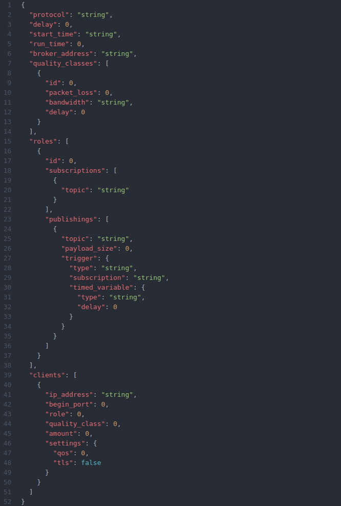

# Publish / Subscribe Benchmark

## Spported Features of the Benchmark

* Benchmarking broker implementations of the MQTT, AMQP and CoAP protocol
* Measurement of the latency, number of messages, message loss and resource consumption
* Configuration of the workload
* Adjustable settings for the run and start time and the number of clients
* Configuration of the network connection quality through packet loss, bandwidth limitation and delay
* TLS and QoS Settings if MQTT is used
* Results accesable directly at the benchmark controler or via HTTP requests sent to the benchmark controller
* Saving multiple run results in `benchmark_run_[run_id]` accesable via `http://.../{run_id}`. The requests shown in "Metrics" always return the results from the latest run.

## Metrics

The benchmark collects the following metrics:

### Latency

Shows the latency for the transmission of the messages. Important: This value only provides reliable information in respect to the time synchronization of the clients (PTP, ...).

**Measurement method:** When each message is published, the current timestamp is included as a payload in the message body. As the message is received by a subscriber, the latency is calculated from the timestamp in the payload and the current timestamp.

**Representation:**
* Latency values of received messages per client as CSV in `results/latency-Client{address}:{port}-rec.csv` or via `http://<benchmark-controller>:5000/results/latency_Client{address}:{port}_csv`
* Latency values of received messages per client as graph in `results/latency-Client{address}:{port}-rec.pdf` or via `http://<benchmark-controller>:5000/results/latency_Client{address}:{port}_graph`
* Latency values of sent messages per client as CSV in `results/latency-Client{address}:{port}-sent.csv` or via `http://<benchmark-controller>:5000/results/latency_Client{address}:{port}_csv`
* Latency values of sent messages per client as graph in `results/latency-Client{address}:{port}-sent.pdf` or via `http://<benchmark-controller>:5000/results/latency_Client{address}:{port}_graph`
* Latency values of all messages per client as CSV in `results/latency-Client{address}:{port}-all.csv` or via `http://<benchmark-controller>:5000/results/latency_Client{address}:{port}_csv`
* Latency values of all messages per client as graph in `results/latency-Client{address}:{port}-all.pdf` or via `http://<benchmark-controller>:5000/results/latency_Client{address}:{port}_graph`
* Latency values of all messages from all clients as CSV in `results/latency-allClients.csv` or via `http://<benchmark-controller>:5000/results/latency_total_csv`
* Latency values of all messages from all clients as graph in `results/latency-allClients.pdf` or via `http://<benchmark-controller>:5000/results/latency_total_graph`
* Mean, median, minimum, maximum and standard deviation of latency per client and in total in `results/Summary.txt` or `results/Summary.txt` or via `http://<benchmark-controller>:5000/results/summary.txt` or `http://<benchmark-controller>:5000/results/summary.csv`

### Cumulated number of messages

This is a count of all sent and received messages.

**Measurement method:** The entries of all sent and received messages from all clients are counted.

**Representation:**

* Every sent and received message per client as CSV in `raw_data/Client{address}:{port}.csv` or via `http://<benchmark-controller>:5000/raw_data/messages`
* The course of received and sent messages per client as graph in `results/messages-Client{address}:{port}.pdf` or via `http://<benchmark-controller>:5000/results/messages_Client{address}:{port}_graph`
* The course of received and sent messages from all clients as graph in `results/messages-allClients.pdf` or via `http://<benchmark-controller>:5000/results/messages_total_graph`
* The total count and throuput per minute per client and in total in `results/Summary.txt` or `results/Summary.txt` or via `http://<benchmark-controller>:5000/results/summary.txt` or `http://<benchmark-controller>:5000/results/summary.csv`

### Message Loss

The amount of times a message was not received by the according client. If a message is published and the respective topic was subscribed by multiple clients each client that did not receive the message will count as one loss and the losses will be added.

**Measurement method:** According to the configured workload the amount of times each published message should be received is computed. This will be substracted by the amount of times they were received.

**Representation:**

* The amount of losses for each sent message as csv in `results/losses.csv` or via `http://<benchmark-controller>:5000/results/losses_total_csv`
* The cumulative sum of losses as graph in `results/losses.pdf` or via `http://<benchmark-controller>:5000/results/losses_total_graph`

### CPU load (Client)

Shows both the total CPU load of each client and the CPU load that only the client process generates. For the total CPU load one value for each core is measures, for the CPU load of the process the load is measured in respect to the capabilities of only one core. This means that 200% will be reported if all four cores of a CPU are utilized at 50%.

**Measurement method:** A measurement of the total CPU load and the load which is generated by the client process is made every second during the benchmark runtime.

**Representation:**

* CPU load values per client of the total load and the load generated by the client process as CSV in `raw_data/Client{address}:{port}-resources.csv` or via `http://<benchmark-controller>:5000/raw_data/resources`
* Total CPU load per client as graph in `results/CPU_total-Client{address}:{port}.pdf` or via `http://<benchmark-controller>:5000/results/cpu_graphs`
* CPU load of only client process per client as graph in `results/CPU_of_process-Client{address}:{port}.pdf` or via `http://<benchmark-controller>:5000/results/cpu_graphs`
* Mean and standard deviation of the total CPU load and load generated by the process in `results/Summary.txt` or `results/Summary.txt` or via `http://<benchmark-controller>:5000/results/summary.txt` or `http://<benchmark-controller>:5000/results/summary.csv`

### RAM usage (Client)

Depicts the RAM load of each client and the amount of RAM that is used by the client process.

**Measurement method:** Every second the utilization RAM of the client machine and the amount of RAM that the client process alone uses are measured.

**Representation:**

* Total RAM load and RAM usage per client of client process as CSV in `raw_data/Client{address}:{port}-resources.csv` or via `http://<benchmark-controller>:5000/raw_data/resources`
* Total RAM load per client as graph in `results/RAM_total-Client{address}:{port}.pdf` or via `http://<benchmark-controller>:5000/results/ram_graphs`
* RAM load of client process as graph in `results/RAM_of_process-Client{address}:{port}.pdf` or via `http://<benchmark-controller>:5000/results/ram_graphs`
* Mean and standard deviation of total RAM usage and load generated by the process in `results/Summary.txt` or `results/Summary.txt` or via `http://<benchmark-controller>:5000/results/summary.txt` or `http://<benchmark-controller>:5000/results/summary.csv`


## Description of RAW result files

**Resource file:** The first column from the right side is the RAM usage of the client process, next is the total RAM load. On column further to the left is the CPU load of the client process alone. The remaining columns on the left side each represent the total CPU load of one core of the client machine

**Messaging file:** Starting from the left side, the first column shows if the registered message was a sent or received message, indicated by an "s" or an "r". The next column depicts the UUID of the message, which is generated for each sent message. Following is the timestamp when the message was sent or received by the client and the last column shows the topic that was used to publish this message.

## Description of the Configuration

```json
{
  "protocol": "string",
  "delay": 0,
  "start_time": "string",
  "run_time": 0,
  "broker_address": "string",
  "quality_classes": [
    {
      "id": 0,
      "packet_loss": 0,
      "bandwidth": "string",
      "delay": 0
    }
  ],
  "roles": [
    {
      "id": 0,
      "subscriptions": [
        {
          "topic": "string"
        }
      ],
      "publishings": [
        {
          "topic": "string",
          "payload_size": 0,
          "trigger": {
            "type": "string",
            "subscription": "string",
            "timed_variable": {
              "type": "string",
              "delay": 0
            }
          }
        }
      ]
    }
  ],
  "clients": [
    {
      "ip_address": "string",
      "begin_port": 0,
      "role": 0,
      "quality_class": 0,
      "amount": 0,
      "settings": {
        "qos": 0,
        "tls": false
      }
    }
  ]
}
```


To start a benchmark run a valid configuration has to be given. First either "MQTT", "AMQP" or "CoAP" has to be defined as `protocol`. The `delay` and the `start_time` both configure when the benchmark run starts. Only one of the two has to be given. When using the `start_time` option only dates in ISO 8601 format `[YYYY]-[MM]-[DD]T[HH]:[MM]:[SS]` are accepted. The `runtime` defines the runtime of the benchmark in seconds and for the `broker_address` the IP address of the used broker has to be given.

The quality classes are used to configure the network connection of the clients. Here the `id` is used to assign the quality class to a client, `packet_loss` is a float between 0 and 1, `bandwidth` accepts parameters with a float number followed by a unit, for example `10kbit`. The `delay` option defines the network delay in ms.

The workload configuration is done by defining roles that are assigned to clients. These roles need an `id`, a list of `subscriptions` and a list of `publishings`. One subscription element simply contains a `topic` string, that has to be valid for the used protocol. A publishing also needs a `topic` to which the message should be published, a `payload_size` in byte as well as a `trigger` defining when the message is published. Possible types are `"interval"` and `"response"`. When using a response a topic has to be given to which the client should respond to. Lastly a `timed_variable` is needed to define either the delay of the response or the interval rate. Here the possible types are `rate`, `exponentialDistribution`, and `fixedDelay`. The `delay` is a integer number defining the delay or expected delay in ms.

The description of the clients is done via the `clients` list. Here an IP address and port has to be given. To assign a role and quality class to the clients the IDs have to be set. If multiple clients with the same settings are used an amount can be set, which will use the ports between the `begin_port` and `begin_port` + `amount`. Lastly when using MQTT Quality of Service and TLS settings can be set.

## Setup of the benchmark

To run this benchmark the following components are needed: one benchmark controller, benchmark clients and a messaging broker. To start the benchmark controller and the clients it is possible to either run the python code directly or the docker images `gitlab2.informatik.uni-wuerzburg.de:4567/descartes/iot-and-cps/iot-pubsub-benchmark-client/client` and `gitlab2.informatik.uni-wuerzburg.de:4567/descartes/iot-and-cps/iot-pubsub-benchmark-client/controller`. Now to start the benchmark run send a PUT request with the configuration to `http://<benchmark-controller>:5000/startBenchmark`. To collect the measurement results at the benchmark controller send a GET request to `http://<benchmark-controller>:5000/collectResults`. To evaluate the measurement results and compute the described metrics a GET request has to be sent to `http://<benchmark-controller>:5000/evaluate`. Now the benchmark results can be accesed from the benchmark controller which is described in "Metrics".