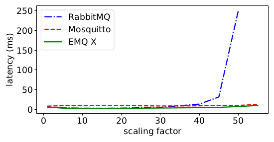
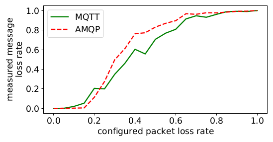

# Example Measurements
This directory contains some examples that showcase several scenarios that can
be analysed with this benchmark. This includes the efficiency of different 
protocols and the QoS levels of MQTT, broker resiliency, and the impact of TLS 
on CPU utilization with MQTT, as well as network limitations. For each scenario 
there is a Graph depicting the result, the raw measurement values, that were 
extracted from the benchmark results, as well as the used configuration.

## Broker Resilience
To test the broker resilience we used the supermarket supply chain workload scenario from the SPECjms2007
benchmark to see how different broker implementations for MQTT perform under 
increasing load. Here we increased the number of clients through the horizontal 
scaling as described in the SPECjms2007 design notes. The scaling factors 1, 5,
10, 15, 20, 30, 40, 45, 50, and 55 were used.

## Protocol Efficiency
This scenario is aimed to analyze the efficiency of the MQTT, AMQP, and CoAP 
protocols at different payload sizes. The efficiency of the protocols in this 
case is the ratio between the payload of all messages and the total amount of 
transferred bytes. The benchmark was configured to run for 60 seconds with a 
client publishing 10 messages per seconds. The values for the payload ranged 
from 100 to 1000 in steps of 100 bytes.

In addition to changing the protocols we also looked at the efficiency of MQTTs 
QoS levels. Here the payload size ranged from 200 to 10000 in steps of 200 
bytes.

## Effect of Packet Loss

To investigate the effect of packet loss on MQTT and AMQP we configured the 
benchmark to send 10 messages per second with a runtime of 20 seconds. The 
packet loss was then set in 5 percent steps from 0 to 100 percent. For each 
packet loss step the benchmark was run 20 times and the average losses were 
calculated.

## Impact of TLS for MQTT on CPU utilization

In this scenario we analyzed the impact of TLS with the MQTT protocol with different
message frequencies. Here we looked at the average CPU utilization of the client process in 
respect to one core. The benchmark was set up to run 60 seconds with a fixed payload size 
of 100 bytes. The message frequency ranged from 20 to 100 messages per second.

## Bandwidth Limitation

The last scenario showcases the impact of a varying connection quality in respect to 
available bandwidth. To simulate this we set a bandwidth limit that changes during runtime.
In the beginning the limit is set to 100 kbps and is decreased at 20 seconds to 30 kbps. At 
50 seconds in runtime the limit is further decreased to only 2 kbps until 80 seconds. From there on 
the bandwidth is increased to 500 kbps. One client is configured to publish 67 messages per second
with a payload of 1000 bytes. The result graph shows how many messages are pending during the time
with low available bandwidth and how fast the pending messages are received once the bandwidth is 
increased again.

