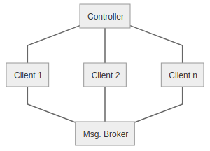

# ComBench2020: A Benchmark for Publish/Subscribe Communication Protocols in IoT Systems

## Introduction

The repository hosts our IoT communication benchmark *ComBench2020*, focusing on publish/subscribe protocols in the IoT context.
With this benchmark, communication scenarios with different publish/subscribe network protocols can be tested.
The application layer protocol to be used can be selected from MQTT, AMQP, and CoAP at the beginning of a measurement.
The workload can be flexibly defined by a simple configuration. The benchmark provides a controller for central control and evaluation of the measurement results.
The provided multi-protocol client can be easily instantiated on multiple nodes, allowing the number of clients to be scaled up. During the measurement, latency, message throughput, and resource consumption are captured.
When designing the benchmark, one focus was on easy deployment and intuitive operation. Both benchmark controller and clients can, therefore, be started as docker containers.

## Benchmark Features

* Benchmarking communication scenarios with the MQTT, AMQP and CoAP protocol
* flexible workload configuration
* high scalable number of clients
* configuration of network quality parameters like packet loss, bandwidth limitation, and delay
* TLS and QoS configuration if MQTT is used
* measurement of the latency, number of messages, message loss and resource consumption, provided as CSV files and plots
* results accessable directly at the benchmark controller or via HTTP requests sent to the benchmark controller

## Metrics

The Benchmark supports and captures the following metrics:

* latency
* number of messages
* message loss
* CPU load (client)
* RAM usage (client)

## Architecture

The benchmark suite consists of the central benachmark controller.
The controller communicates via a HTTP REST-API to the clients to set the desired Pub/Sub protocol and configures the workload and communication behavior of each client.
Furthermore the controller collects the raw measurements results from the clients at the end of the benchmark run.
The results are preprocessed after that in in controller and are provided centrally from the controller to the user.
The clients can theoretically be scaled to an unlimited number.
The clients support all used protocols of the benchmark.
Switching between the protocols does not require any manual reconfiguration of the clients.
During the benchmark the clients communicate via a central message broker, which is not part of the benchmark, to each other.
Several network interferences can be configured for this communication.
An overview of the architecture of the benchmark is shown in the following figure.



## Running the benchmark

In order to run this benchmark the benchmark components need to be set up, a configuration has to be made and then the benchmark can be run. These three steps are described in more detail in the following sections.

### Setup of the benchmark

The benchmark can be set up in three different ways.
The first way is to start the Python applications manually, the second way is via Docker-Compose and the third way is to start the Docker containers individually.

#### 1. Setup by starting the Python applications manually
Start one benchmark controller on localhost address on port 5000 via
```shell
python app.py
```
To start the controller listening to a specific address and port use
```shell
hypercorn app:app - b <ip-address>:<port>
```

Start multiple clients via
```shell
hypercorn API:app -b <ip-address>:<port>
```
Note: You have to select different ports if multiple clients are instantiated on the same host.

#### 2. Setup by Docker-Compose
To set up one controller use 
```docker-compose
controller:
    image: "descartesresearch/iot-pubsub-benchmark-controller:latest"
    ports:
      - "<port on host>:5000"
```

To set up the clients use
```docker-compose
client:
    image: "descartesresearch/iot-pubsub-benchmark-client:latest"
    ports:
      - "<port on host>:5000"
    privileged: true
    cap_add:
      - ALL
    volumes:
      - /dev:/dev
      - /lib/modules:/lib/modules
      
```
Note: You have to select different ports if multiple clients are instantiated on the same host.

To start the controller and client services run
```shell
docker-compose up
```

An example Docker-Compose file can be found [here](docs/docker-compose.yml).

#### 3. Setup by individual Docker containers
Start one benchmark controller via 
```shell
docker run -d -p 5000:5000 descartesresearch/iot-pubsub-benchmark-controller
```

Start multiple clients via
```shell
docker run --cap-add ALL -d -p 5000:5000 -v /dev:/dev -v /lib/modules:/lib/modules descartesresearch/iot-pubsub-benchmark-client
```
Note: You have to select different ports if multiple clients are instantiated on the same host.

### Description of the Configuration

```json
{
  "protocol": "string",
  "delay": 0,
  "start_time": "string",
  "run_time": 0,
  "broker_address": "string",
  "quality_classes": [
    {
      "id": 0,
      "packet_loss": 0,
      "bandwidth": "string",
      "delay": 0,
      "time_series": [
        [0,0,"string",0.0]
      ]
    }
  ],
  "roles": [
    {
      "id": 0,
      "subscriptions": [
        {
          "topic": "string"
        }
      ],
      "publishings": [
        {
          "topic": "string",
          "payload_size": 0,
          "trigger": {
            "type": "string",
            "subscription": "string",
            "timed_variable": {
              "type": "string",
              "delay": 0
            }
          }
        }
      ]
    }
  ],
  "clients": [
    {
      "ip_address": "string",
      "begin_port": 0,
      "role": 0,
      "quality_class": 0,
      "amount": 0,
      "settings": {
        "qos": 0,
        "tls": false
      }
    }
  ]
}
```

Before a benchmark run can be started a valid configuration has to be made. First either "MQTT", "AMQP" or "CoAP" has to be defined as `protocol`. The `delay` and the `start_time` both configure the time when the benchmark run starts. This can be used to schedule a benchmark run and gives the clients time to apply the settings. Only one of the two has to be given. When using the `start_time` option only dates in ISO 8601 format `[YYYY]-[MM]-[DD]T[HH]:[MM]:[SS][Timezone]` are accepted. The benchmark comonents will always use UTC time when deployed via docker containers. The `runtime` defines the runtime of the benchmark in seconds and for the `broker_address` the IP address of the used broker has to be given.

The quality classes are used to configure the network connection of the clients. Here the `id` is used to assign the quality class to a client, `packet_loss` is a float between 0 and 1, `bandwidth` accepts parameters with a float number followed by a unit, for example `10kbit`. The `delay` option defines the network delay in ms. This can also be configured using a time series to introduce changing network conditions during runtime. This is a List of Lists, each containing the runtime at which the configured values are in effect, the delay value, the bandwidth limit, and the packet loss.

The workload configuration is done by defining roles that are assigned to clients. These roles need an `id`, a list of `subscriptions` and a list of `publishings`. One subscription element simply contains a `topic` string, that has to be valid for the used protocol. A publishing also needs a `topic` to which the message should be published, a `payload_size` in byte as well as a `trigger` defining when the message is published. Possible types are `"interval"` and `"response"`. When using a response a topic has to be given to which the client should respond to. Lastly a `timed_variable` is needed to define either the delay of the response or the interval rate. Here the possible types are `rate`, `exponentialDistribution`, and `fixedDelay`. The `delay` is a integer number defining the delay or expected delay in ms.

The description of the clients is done via the `clients` list. Here an IP address and port has to be given. To assign a role and quality class to the clients the IDs have to be set. If multiple clients with the same settings are used an amount can be set, which will use the ports between the `begin_port` and `begin_port` + `amount`. Lastly when using MQTT Quality of Service and TLS settings can be set.

### Starting the Benchmark

To start the benchmark run a PUT request containing the configuration has to be sent to `http://<benchmark-controller>:5000/startBenchmark`. After the specified seconds in `runtime` from the specified start time the benchmark run stops and the measuring results can be collected from the benchmark controller and then evaluated via GET requestes to `http://<benchmark-controller>:5000/collectResults` and then `http://<benchmark-controller>:5000/evaluate`. After the evalution is finished the results can be acquired through the following methods.

## Reporting and Benchmark Results

The results of each run are stored in `benchmark_run_[run_id]` at the benchmark controller. 
The requests shown in the following always return the results from the latest run. To access the results from a specific run use `http://.../{run_id}`.

### Latency

Shows the latency for the transmission of the messages. Important: This value only provides reliable information in respect to the time synchronization of the clients (PTP, ...).

**Measurement method:** When each message is published, the current timestamp is included as a payload in the message body. As the message is received by a subscriber, the latency is calculated from the timestamp in the payload and the current timestamp.

**Representation:**
* Latency values of received messages per client as CSV in `results/latency-Client{address}:{port}-rec.csv` or via `http://<benchmark-controller>:5000/results/latency_Client{address}:{port}_csv`
([Example](docs/results_example/results/latency-Client172.17.0.1:5001-rec.csv))
* Latency values of received messages per client as graph in `results/latency-Client{address}:{port}-rec.pdf` or via `http://<benchmark-controller>:5000/results/latency_Client{address}:{port}_graph`
([Example](docs/results_example/results/latency-Client172.17.0.1:5001-rec.pdf))
* Latency values of sent messages per client as CSV in `results/latency-Client{address}:{port}-sent.csv` or via `http://<benchmark-controller>:5000/results/latency_Client{address}:{port}_csv`
([Example](docs/results_example/results/latency-Client172.17.0.1:5001-sent.csv))
* Latency values of sent messages per client as graph in `results/latency-Client{address}:{port}-sent.pdf` or via `http://<benchmark-controller>:5000/results/latency_Client{address}:{port}_graph`
([Example](docs/results_example/results/latency-Client172.17.0.1:5001-sent.pdf))
* Latency values of all messages per client as CSV in `results/latency-Client{address}:{port}-all.csv` or via `http://<benchmark-controller>:5000/results/latency_Client{address}:{port}_csv`
([Example](docs/results_example/results/latency-Client172.17.0.1:5001-combined.csv))
* Latency values of all messages per client as graph in `results/latency-Client{address}:{port}-all.pdf` or via `http://<benchmark-controller>:5000/results/latency_Client{address}:{port}_graph`
([Example](docs/results_example/results/latency-Client172.17.0.1:5001-combined.pdf))
* Latency values of all messages from all clients as CSV in `results/latency-allClients.csv` or via `http://<benchmark-controller>:5000/results/latency_total_csv`
([Example](docs/results_example/results/latency-allClients.csv))
* Latency values of all messages from all clients as graph in `results/latency-allClients.pdf` or via `http://<benchmark-controller>:5000/results/latency_total_graph`
([Example](docs/results_example/results/latency-allClients.pdf))
* Mean, median, minimum, maximum and standard deviation of latency per client and in total in `results/Summary.txt` or `results/Summary.txt` or via `http://<benchmark-controller>:5000/results/summary.txt` or `http://<benchmark-controller>:5000/results/summary.csv`
([Example](docs/results_example/results/Summary.csv))

### Cumulated number of messages

This is a count of all sent and received messages.

**Measurement method:** The entries of all sent and received messages from all clients are counted.

**Representation:**

* Every sent and received message per client as CSV in `raw_data/Client{address}:{port}.csv` or via `http://<benchmark-controller>:5000/raw_data/messages`
* The course of received and sent messages per client as graph in `results/messages-Client{address}:{port}.pdf` or via `http://<benchmark-controller>:5000/results/messages_Client{address}:{port}_graph`
([Example](docs/results_example/results/messages-Client172.17.0.1:5001.pdf))
* The course of received and sent messages from all clients as graph in `results/messages-allClients.pdf` or via `http://<benchmark-controller>:5000/results/messages_total_graph`
([Example](docs/results_example/results/messages-allClients.pdf))
* The total count and throuput per minute per client and in total in `results/Summary.txt` or `results/Summary.txt` or via `http://<benchmark-controller>:5000/results/summary.txt` or `http://<benchmark-controller>:5000/results/summary.csv`
([Example](docs/results_example/results/Summary.csv))

### Message Loss

The amount of times a message was not received by the according client. If a message is published and the respective topic was subscribed by multiple clients each client that did not receive the message will count as one loss and the losses will be added.

**Measurement method:** According to the configured workload the amount of times each published message should be received is computed. This will be substracted by the amount of times they were received.

**Representation:**

* The amount of losses for each sent message as csv in `results/losses.csv` or via `http://<benchmark-controller>:5000/results/losses_total_csv`
([Example](docs/results_example/results/losses-allClients.csv))
* The cumulative sum of losses as graph in `results/losses.pdf` or via `http://<benchmark-controller>:5000/results/losses_total_graph`
([Example](docs/results_example/results/losses-allClients.pdf))

### CPU load (Client)

Shows both the total CPU load of each client and the CPU load that only the client process generates. For the total CPU load one value for each core is measures, for the CPU load of the process the load is measured in respect to the capabilities of only one core. This means that 200% will be reported if all four cores of a CPU are utilized at 50%.

**Measurement method:** A measurement of the total CPU load and the load which is generated by the client process is made every second during the benchmark runtime.

**Representation:**

* CPU load values per client of the total load and the load generated by the client process as CSV in `raw_data/Client{address}:{port}-resources.csv` or via `http://<benchmark-controller>:5000/raw_data/resources`
* Total CPU load per client as graph in `results/CPU_total-Client{address}:{port}.pdf` or via `http://<benchmark-controller>:5000/results/cpu_graphs`
([Example](docs/results_example/results/CPU_total-Client172.17.0.1:5001.pdf))
* CPU load of only client process per client as graph in `results/CPU_of_process-Client{address}:{port}.pdf` or via `http://<benchmark-controller>:5000/results/cpu_graphs` 
([Example]docs/results_example/results/CPU_of_process-Client172.17.0.1:5001.pdf())
* Mean and standard deviation of the total CPU load and load generated by the process in `results/Summary.txt` or `results/Summary.txt` or via `http://<benchmark-controller>:5000/results/summary.txt` or `http://<benchmark-controller>:5000/results/summary.csv` 
([Example](docs/results_example/results/Summary.csv))

### RAM usage (Client)

Depicts the RAM load of each client and the amount of RAM that is used by the client process.

**Measurement method:** Every second the utilization RAM of the client machine and the amount of RAM that the client process alone uses are measured.

**Representation:**

* Total RAM load and RAM usage per client of client process as CSV in `raw_data/Client{address}:{port}-resources.csv` or via `http://<benchmark-controller>:5000/raw_data/resources`
* Total RAM load per client as graph in `results/RAM_total-Client{address}:{port}.pdf` or via `http://<benchmark-controller>:5000/results/ram_graphs`
([Example](docs/results_example/results/ram_total-Client172.17.0.1:5001.pdf))
* RAM load of client process as graph in `results/RAM_of_process-Client{address}:{port}.pdf` or via `http://<benchmark-controller>:5000/results/ram_graphs`
([Example](docs/results_example/results/ram_of_process-Client172.17.0.1:5001.pdf))
* Mean and standard deviation of total RAM usage and load generated by the process in `results/Summary.txt` or `results/Summary.txt` or via `http://<benchmark-controller>:5000/results/summary.txt` or `http://<benchmark-controller>:5000/results/summary.csv`
([Example](docs/results_example/results/Summary.csv))


### Description of RAW result files

**Resource file:** The first column from the right side is the RAM usage of the client process, next is the total RAM load. On column further to the left is the CPU load of the client process alone. The remaining columns on the left side each represent the total CPU load of one core of the client machine.
([Example](docs/results_example/raw_data/Client172.17.0.1:5001-resources.csv))

**Messaging file:** Starting from the left side, the first column shows if the registered message was a sent or received message, indicated by an "s" or an "r". The next column depicts the UUID of the message, which is generated for each sent message. Following is the timestamp when the message was sent or received by the client and the last column shows the topic that was used to publish this message.
([Example](docs/results_example/raw_data/Client172.17.0.1:5001.csv))


## Example Usage of the Benchmark

This section gives an example of how the benchmark can be set up and run. This example uses docker-compose to run both the clients and the benchmark controller and uses the public MQTT broker available at `test.mosquitto.org`. 

First a docker-compose file is needed. For this the following content has to be saved in an empty file named `docker-compose.yml`: 

```bash
version: "3.7"

services:

  controller:
    image: "descartesresearch/iot-pubsub-benchmark-controller:latest"
    ports:
      - "5000:5000"

  client1:
    image: "descartesresearch/iot-pubsub-benchmark-client:latest"
    ports:
      - "5001:5000"
    cap_add:
      - NET_ADMIN
      
  client2:
    image: "descartesresearch/iot-pubsub-benchmark-client:latest"
    ports:
      - "5002:5000"
    cap_add:
      - NET_ADMIN
```

To start the two clients and the controller simply execute `sudo docker-compose up` in a terminal in the directory of the `docker-compose.yml` file.

Now to start a benchmark run a viable configuration has to be sent to `http://localhost:5000/startBenchmark`. In this example the following python scipt is used to do so:

```python
import requests
import json

f = open("BenchmarkConfiguration.json")
data = json.load(f)
print(data)
r = requests.put("http://localhost:5000/startBenchmark", json=data)
```
The configuration that was used is written in the file `BenchmarkConfiguration.json` and is located in the same directory as the python script with the following content:

```json
{
  "protocol": "MQTT",
  "delay": 10,
  "run_time": 30,
  "broker_address": "test.mosquitto.org",

  "quality_classes": [
    {
      "id": 0
    },
    {
      "id": 1
    }
  ],

  "roles" : [
    {
      "id": 0,
      "subscriptions" : [
        { "topic" : "Temperatur/Schlafzimmer" },
        { "topic" : "Temperatur/Küche" },
        { "topic" : "Temperatur/Flur" }
      ],
      "publishings" : [
        {
          "topic" : "Heizung/Schlafzimmer",
          "payload_size" : 10,
          "trigger" : {
            "type" : "response",
            "subscription" : "Temperatur/Schlafzimmer",
            "timed_variable" : {
              "type" : "fixedDelay",
              "delay" : "100"
            }
          }
        },
        {
          "topic" : "Heizung/Küche",
          "payload_size" : 10,
          "trigger" : {
            "type" : "response",
            "subscription" : "Temperatur/Küche",
            "timed_variable" : {
              "type" : "fixedDelay",
              "delay" : "100"
            }
          }
        },
        {
          "topic" : "Heizung/Flur",
          "payload_size" : 10,
          "trigger" : {
            "type" : "response",
            "subscription" : "Temperatur/Flur",
            "timed_variable" : {
              "type" : "fixedDelay",
              "delay" : "100"
            }
          }
        }
      ]
    },
    {
      "id": 1,
      "subscriptions" : [
        { "topic" : "Heizung/Schlafzimmer"},
        { "topic" : "Heizung/Küche"},
        { "topic" : "Heizung/Flur"}
      ],
      "publishings" : [
        {
          "topic" : "Temperatur/Küche",
          "payload_size" : 2,
          "trigger" : {
            "type" : "interval",
            "timed_variable" : {
              "type" : "rate",
              "delay" : "1000"
            }
          }
        },
        {
          "topic" : "Temperatur/Schlafzimmer",
          "payload_size" : 2,
          "trigger" : {
            "type" : "interval",
            "timed_variable" : {
              "type" : "exponentialDistribution",
              "delay" : "1000"
            }
          }
        },
        {
          "topic" : "Temperatur/Flur",
          "payload_size" : 2,
          "trigger" : {
            "type" : "interval",
            "timed_variable" : {
              "type" : "rate",
              "delay" : "1500"
            }
          }
        }
      ]
    }
  ],

  "clients": [
    {
      "ip_address": "172.17.0.1",
      "begin_port": 5001,
      "role": 0,
      "quality_class": 0,
      "amount": 1,
      "settings": {
        "qos": 0,
        "tls": false
      }
    },
    {
      "ip_address": "172.17.0.1",
      "begin_port": 5002,
      "role": 1,
      "quality_class": 1,
      "amount": 1,
      "settings": {
        "qos": 0,
        "tls": false
      }
    }
  ]
}

```

Since all parts of the benchmark in this example are run on the same machine the benchmark controller can access the benchmark clients through the docker bridge via the ip address `172.17.0.1`. Once the benchmark stops sending messages the measurement results have to be collected by the benchmark controller and evaluated. For this the following pyhton script can be used:

```python
import requests

r = requests.get("http://localhost:5000/collectResults")
r2 = requests.get("http://localhost:5000/evaluate")
```

After the evaluation of the benchmark run the results can be accesed via the requests described in "Metrics", for example to get all results `localhost:5000/results/all_results` can be called in a browser on the host machine.


## API

The controller as well as the client provide REST-APIs for configuration and measurement purposes.
The controller API is intended for use by the benchmark operator, while the client API should only be used internally by the controller.
The API description can be found at the following locations:
* [Controller API](docs/controller-api/openapi.json)
* [Client API](docs/client-api/openapi.json)
