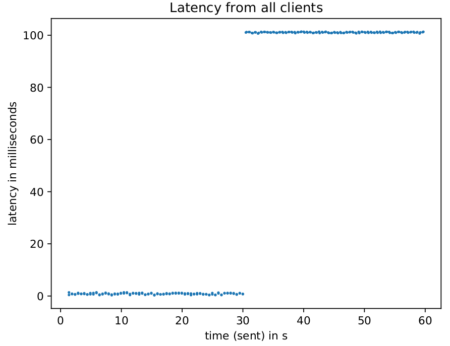

# Validation of Network Settings

## Network Delay

In order to validate the network delay setting two benchmarks are run with the same configuration except for the delay setting. One run has no network delay setting and the other one has 100 ms set as delay for one client.
The following Table shows the result of these runs. These measurements show an increase of 100 ms in latency for the runs where the delay of 100 ms was set. The standard deviation for both configurations was about 0.3 ms.

|                    | without delay | with 100 ms delay |
|--------------------|---------------|-------------------|
| mean latency       | 1.31 ms       | 101.43 ms         |
| standard deviation | 0.27 ms       | 0.26 ms           |

The following graphs show the latency values from one of these runs from both confugurations. There it can also be seen that both the received and sent messages were affected.

### Graph without delay

### Graph with 100 ms delay

### Graph with 100 ms delay after 30 sec runtime

## Bandwidth limitation

To validate the bandwidth limitation a setup was run with two clients.
The first client published a message every 20 ms with a payload of 10 kbytes.
The second client subscribed to this message and sent a reaction message with the same payload.
This configuration was run without a bandwidth limit, with a bandwidth limit of 250 kbps, 
and with a bandwidth limit of 250 kbps after 30 sec runtime. 
The results graphs from the sent and received bytes can be seen below.
### Graph without bandwidth limit

### Graph with 250 kbps bandwidth limit

### Graph with 250kbps bandwidth limit after 30 sec runtime

